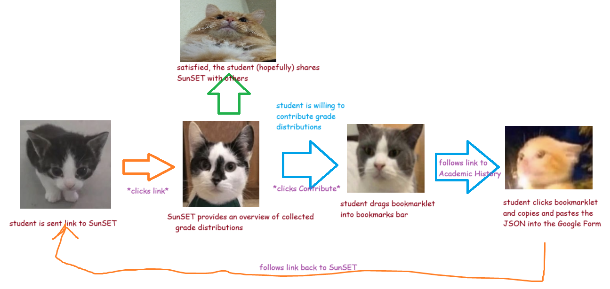
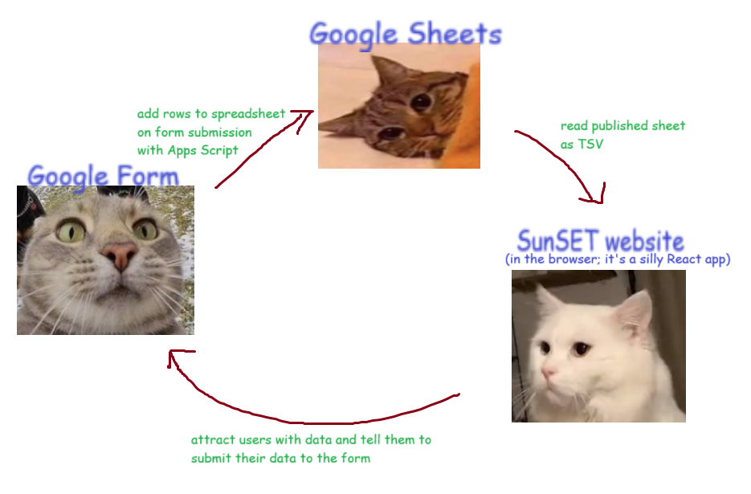

# SunSET for UCSD

A crowdsourced dataset of grade distributions submitted by students from their academic histories, to replace CAPEs' "Grades Students Received," which SETs no longer publish.

## Usage

The crowdsourced dataset is available to view on the [live website][gh-pages]. Click on the "Contribute" button for instructions on how to contribute your classes' grade distributions from your [Academic History][acad-hist].

The raw dataset is also available as a [spreadsheet][pubhtml]. If you want to load it into a program, you can format it as a [CSV][csv] or [TSV][tsv] file to perform your own data analysis and visualization.

[gh-pages]: https://sheeptester.github.io/ucsd-sunset/
[pubhtml]: https://docs.google.com/spreadsheets/d/e/2PACX-1vQ6KhjyiPM-rof6fqjBcmp7ygy4Dqr1LQ8uJiAOtR2IoihzQEumx-SHX_KKxLpmYGZksN6QsPPk0DNb/pubhtml
[csv]: https://docs.google.com/spreadsheets/d/e/2PACX-1vQ6KhjyiPM-rof6fqjBcmp7ygy4Dqr1LQ8uJiAOtR2IoihzQEumx-SHX_KKxLpmYGZksN6QsPPk0DNb/pub?single=true&output=csv
[tsv]: https://docs.google.com/spreadsheets/d/e/2PACX-1vQ6KhjyiPM-rof6fqjBcmp7ygy4Dqr1LQ8uJiAOtR2IoihzQEumx-SHX_KKxLpmYGZksN6QsPPk0DNb/pub?single=true&output=tsv

## Setup and design

### Background

For the past decade, UCSD has used [CAPEs][capes] to allow students to evaluate their courses and professors sometime before finals. The results of these evaluations were published alongside the actual grade distribution received by the class (shown alongside a distribution of students' expected grade when filling out the evaluation). Apparently, it started out as a student project but became adopted by the university to evaluate instructors.

UCSD recently switched to a new system for evaluations, [SETs][sets], which has a new set of questions better tailored for evaluating instructors rather than aiding future students. Among these changes, ["Would you recommend this instructor/class?"][reddit-recommend] and the [distribution of grades received][reddit-distribution] were removed.

Fortunately, [academic history][acad-hist] still publishes grade distributions, but only for the sections you were enrolled in. It also is more fine grained, including signed letter grades (A+ vs A-) and other letters (P, NP, W). Ideally, we could crowdsource these grade distributions from all sections by having students submit them voluntarily into a public dataset for anyone to look through.

[acad-hist]: https://act.ucsd.edu/studentAcademicHistory/academichistorystudentdisplay.htm
[capes]: https://cape.ucsd.edu/
[sets]: https://academicaffairs.ucsd.edu/Modules/Evals/SET/Reports/Search.aspx
[reddit-recommend]: https://www.reddit.com/r/UCSD/comments/1864lbf/anyone_notice_how_they_removed_recommend/
[reddit-distribution]: https://www.reddit.com/r/UCSD/comments/18oivyp/how_do_we_see_set_results/

### Goals

The main purpose of this project is data collection, rather than presentation. I assume that other students can make better analyses of the collected data. Therefore, the goals are:

- Allow students to easily contribute grade distribution data.
- Publish the collected data for any student to use.
- Make the collected data immediately presentable to help spread the word.
- Ensure the project can continue to work without active maintenance (i.e. does not require keeping a server running).
- Make attempts to preserve student privacy, and make any privacy concerns clear.

And non-goals:

- Clean up data from malicious contributors. This will be left to data consumers to filter out and process the contributed data.
- Keep contributors anonymous. We wouldn't lose too much from omitting hashed student emails from the dataset, but it might help with processing data (e.g. filtering out malicious contributors or removing duplicate submissions), and I don't think the list of courses taken by a student is too sensitive.
- Asking if students recommend a professor or class, at least for now. [r/UCSD][reddit] and [RMP][rmp] are probably good enough, but it wouldn't be too much work to ask contributors for their recommendations.

[rmp]: https://www.ratemyprofessors.com/
[reddit]: https://www.google.com/search?q=site%3Areddit.com%2Fr%2Fucsd

SunSET itself does not focus on good data presentation or cleaning up data. I'm hoping that other students can make a project like [Seascape][seascape] to visualize the data better. Rather, the website is just a starting point so there are immediately results to show to get more students to contribute their data.

[seascape]: https://seascape.app/

### Design

Here is an overview of the user flow for SunSET:



And here's an architectural diagram:



To collect data, students run a bookmarklet on Academic History. Bookmarklets are the easiest way for students to run our data collection script, as opposed to a browser extension or userscript.

To store the data, students submit the JSON output of the bookmarklet into a [Google Form][form], which requires a UCSD Google account to access. There is a single question for students to paste the data in, and it collects their email to discourage students from misusing the service.

The Google Form has a [Google Apps Script][apps-script] connected that [adds the student-submitted grade distributions into a spreadsheet](./form/Code.gs). This spreadsheet is published to the web, so anyone can download it as a [CSV][csv] or [TSV][tsv] file.

[form]: https://docs.google.com/forms/d/e/1FAIpQLSdRQu1lV9dlmMFYKVqQVC_p9V2oNv3qmAdG1IjsoeGmZ0V9OA/viewform
[apps-script]: https://developers.google.com/apps-script/reference/forms

### Caveats

Our academic history does not include the section codes that students are enrolled in, but it only shows the grade distribution for the enrolled section. This means that there's no way to tell what section a grade distribution belongs to, and how to distinguish between changes to a section's grades (e.g. blank grades being resolved) from other sections and faked data. This problem is left as an exercise for data consumers.

## Development

This project requires [Node][node]. If you want to use [Yarn][yarn], you can install it with `npm install -g yarn`.

[yarn]: https://yarnpkg.com/
[node]: https://nodejs.org/

```shell
# Start a development server
$ yarn dev
# Build into dist/
$ yarn build
```
